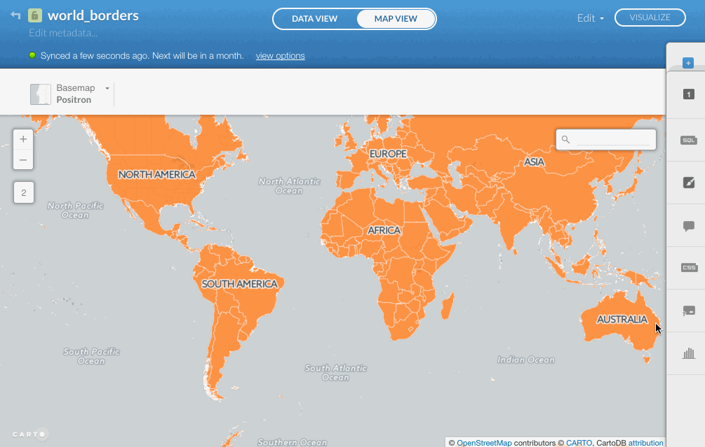
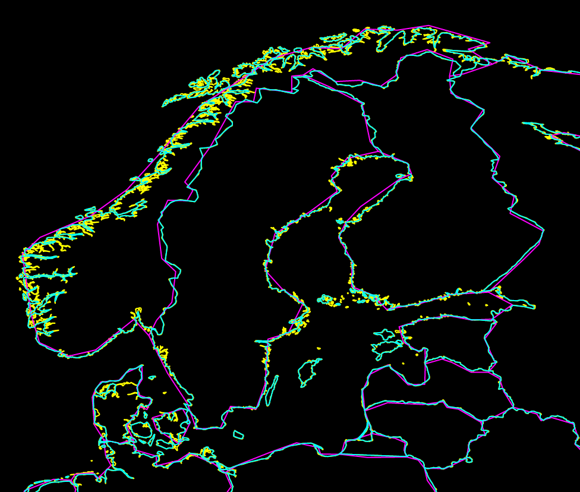
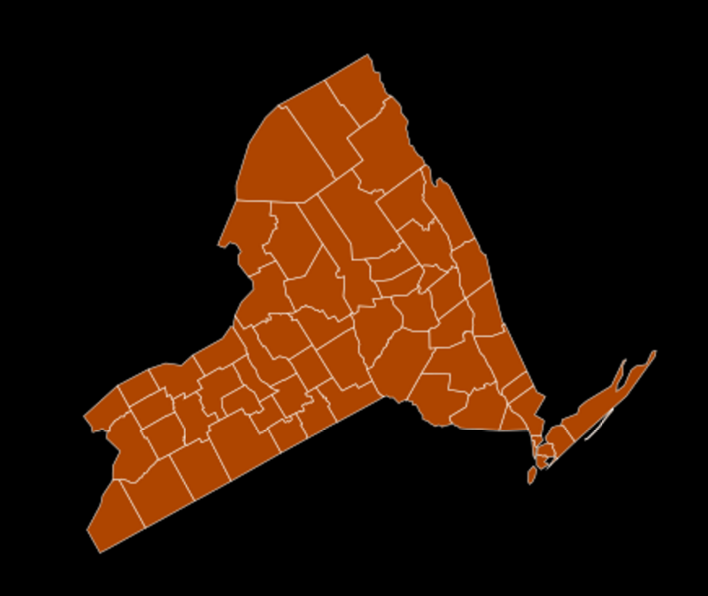
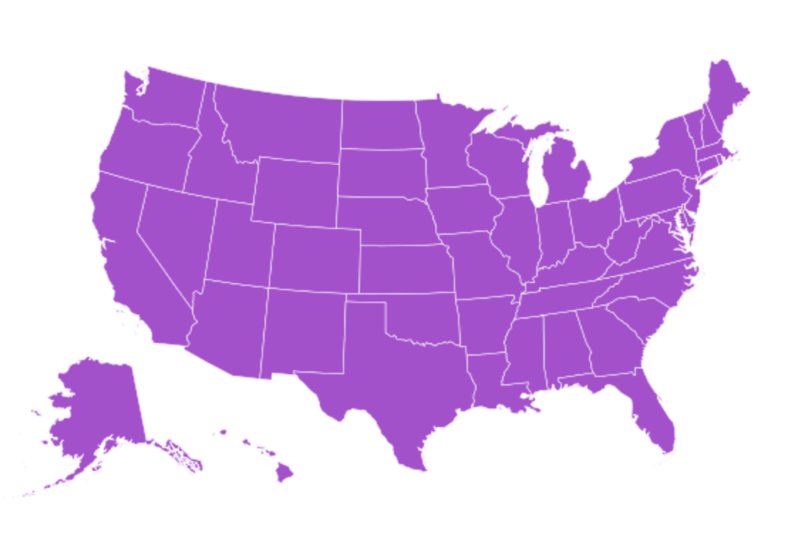
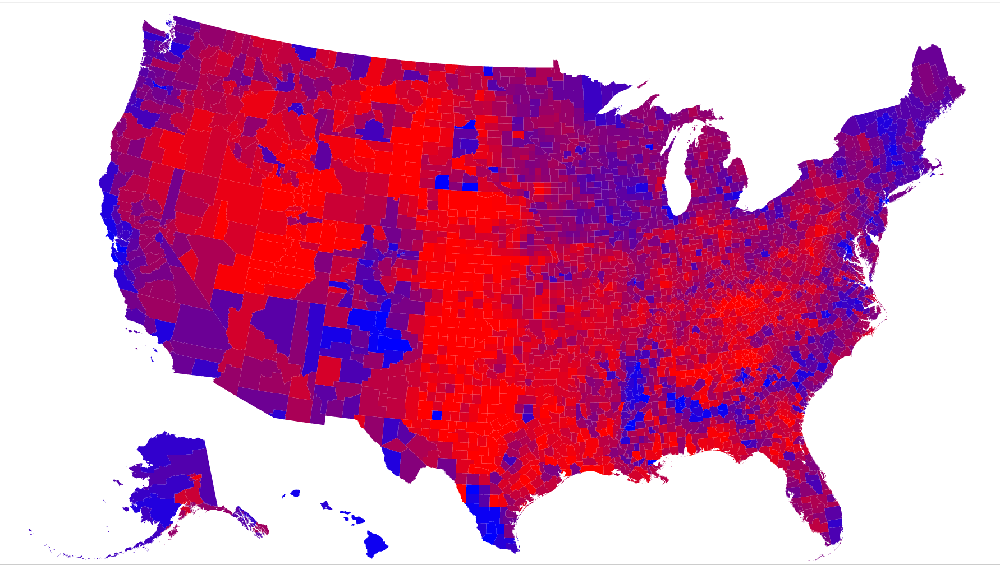
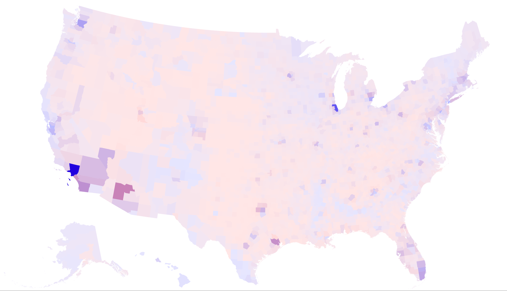
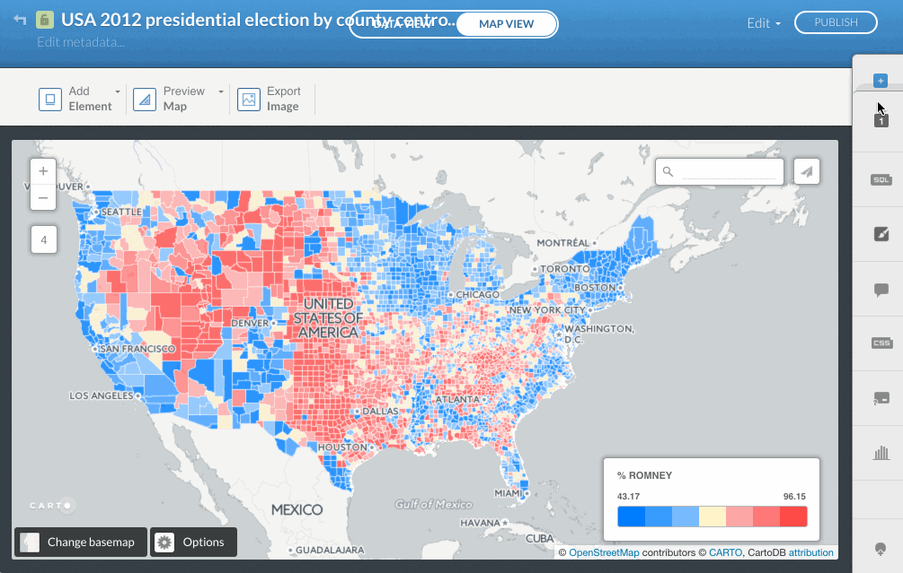
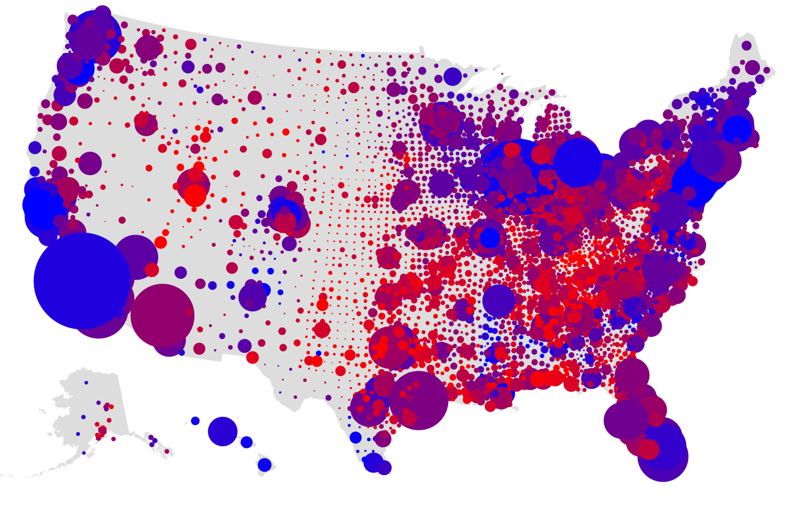
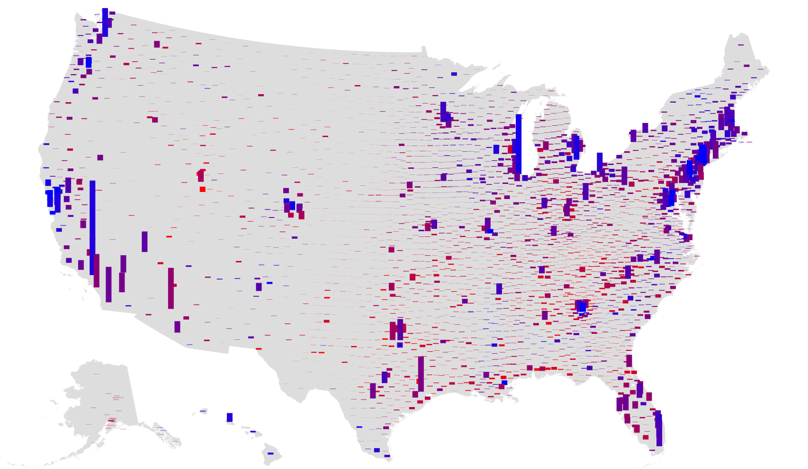

# Designing with spatial data for the web

## Introduction

This workshop is designed to be very hands-on, but slightly _less_ hands-on than [Part 1: Working with spatial data for the web](http://github.com/enjalot/wwsd). We will use some of the same tools as we did last time (like Leaflet and D3.js), and we'll look at a few new ones (like CARTO). 

We will look at many examples that can be extended as exercises, and many more examples that will give you a taste of the possibilities out there, and some leads you can follow if you want to learn more.

It would be impossible to touch everything that we could
find [interesting in web mapping](https://hi.stamen.com/an-ode-to-d3-js-projections-9d6477d6da0b#.1hr10rltk),
so the hope is that after going through these three acts you will feel empowered
to swap in your own data and leverage [hundreds of examples](http://blockbuilder.org/search#api=d3.geo.path) in your own data visualization projects!

# Prelude: the landscape

## An overview of the state of the art
Some [maps we've made at Stamen](http://stamen.com/maps/), and maps we love made by others. What tools did these maps use? Where did the data come from? How and _why_ were they designed this way?

## Servers and clients, rasters and vectors

See: [Anatomy of a web map](http://maptime.io/anatomy-of-a-web-map/)

# Act I: data is part of design

## Data preparation

Choose your data wisely. Clean it throughly. Remove what you don't need! In general, pre-process your data with the end product in mind.

All the tools we will look at can be used for data exploration, your data needs to change when you transition to data _presentation_.

You might need to use [QGIS](qgis.org), but I'd recommend CartoDB (now "[CARTO](http://carto.com)") for most things!

Let's load some data in CARTO, try the web editor to draw features, edit them, etc.

**[1) Getting started with CARTO](https://github.com/stamen/dwsd/issues/1)**

Look at the SQL viewer, and if you're familiar with SQL you can do a lot to transform your data really easily! Let's try extracting just a few features.

Note, if you love the command line, you can do most of this with [GDAL](http://gdal.org)'s program `ogr2ogr`, especially with [@dwtkns's fantastic GDAL cheat sheet](https://github.com/dwtkns/gdal-cheat-sheet). Or you can install [PostGIS](http://postgis.net) locally if you like the database interface of CARTO.

## Generalization

* [Mapshaper](http://www.mapshaper.org/) and [TopoJSON](https://github.com/mbostock/topojson)
  * Review, what is TopoJSON?
  * generalization is not just for file size, it's also important for the _look_ of the map
  * [Use the [Brexit data](http://bl.ocks.org/almccon/7257fe68b3bfa4199e154016d983cddc) as example]

**[2) Generalizing with Mapshaper](https://github.com/stamen/dwsd/issues/2)**

### Natural Earth

Let's do a tour through the wonderful world of [Natural Earth](http://www.naturalearthdata.com/) datasets. Not just what are they, but _why_ are they?

**[3) Comparing levels of generalization in Natural Earth](https://github.com/stamen/dwsd/issues/3)**

Also note the [boundary lines](http://www.naturalearthdata.com/downloads/10m-cultural-vectors/10m-admin-0-boundary-lines/) files. Why would we need those when we have the outlines of the countries already?

For one thing, you can apply a thick line to divide countries from each other without adding a thick stroke along their coastlines, [for example](https://mappingmashups.carto.com/viz/9a44fc38-9ee4-4741-bc4c-2c56b37f9d6f/public_map).

(note, you can also do the same thing with TopoJSON)

### Data precision
  * You don't really need those 8 digits in your decimal degrees: see [geojson-precision](https://www.npmjs.com/package/geojson-precision)
  * See [Decimal degrees on Wikipedia](https://en.wikipedia.org/wiki/Decimal_degrees)

# Act II: numbers to images

## Projections

_Why_ do they matter?

### Have you learned to hate Mercator yet?

["Why are we changing maps?"](https://www.youtube.com/watch?v=vVX-PrBRtTY) (note, _don't_ use the Peters projection either!)

Unless you're using tiles, you probably shouldn't use Mercator.

But wait, why do tiled maps use Mercator? Let's talk about that.

Let's start with the [zoom 0 tile:](http://maps.stamen.com/toner/#0/0/0)

### Projections as a design decision:

If you're making a choropleth (we'll talk about these later), use an equal area projection.

Map of the US, use [Albers USA](http://bl.ocks.org/mbostock/2869946) which has built-in sub-projections for Alaska and Hawaii!

Say, California, use [EPSG:3310 California Albers](http://bl.ocks.org/mbostock/5557726)

Map of the world, consider a [Winkel Tripel](https://bl.ocks.org/mbostock/3682676) (not equal area)

For a city, maybe it doesn't matter if you use Mercator.

BUT! Don't try to compare two city maps side-by-side using Mercator... the scale will be off!

**[4) Leaflet with scale bar and URL location](https://github.com/stamen/dwsd/issues/4)**

Use [Leaflet Control.Scale](http://leafletjs.com/reference.html#control-scale)

### Projected maps vs projected data

Also, projections are not just about how you present your data. Sometimes your coordinates are already projected on disk! GeoJSON is _almost always_ stored in latitude/longitude degrees, but other data sources might be stored in meters, or feet, or pixels (like TopoJSON).

For example, [here's a map](http://bl.ocks.org/almccon/fb125b016b5c9afad99b) that uses a pre-projected topojson file and a null projection.

What do these coordinates look like? See [EPSG:2163 Coordinates](http://bl.ocks.org/mbostock/5050837).

Okay, now what's "2163" mean? Let's talk about that...

### Can I get your projection's number? :phone emoji:

D3 is convenient and it gives all these projections _names_, but if you're using anything other than D3, you might need to know your projection's [EPSG code](http://epsg.io).

A few you might memorize after a while:
  * [EPSG:4326](http://epsg.io/4326) "unprojected" latitude / longitude (a "geographic" projection)
  * [EPSG:3857](http://epsg.io/3857) Web ("Google") Mercator  (old docs will use EPSG:900913)
  * [EPSG:2163](http://epsg.io/2163) [US National Atlas Azimuthal Equal Area](http://bl.ocks.org/mbostock/5050837)
  * [EPSG:3310](http://epsg.io/3310) [California Albers](http://bl.ocks.org/mbostock/5557726)

And sometimes, just sometimes, all those off-the-shelf projections just aren't enough, and you have to make your own projection. Since a projection is just a mathematical formula, it's not that hard to modify existing ones. See [oceanplanning.org](http://oceanplanning.org/)

Or, see what I like to call the ["Hill-Akella Manhattan Projection"](https://mappingmashups.carto.com/viz/0a755882-bfc7-11e5-a827-0e31c9be1b51/public_map)

### How to lie to your mapping tools
Jump over to CartoDB again: how do projections work here?

What happens if we make it _think_ the data is in one projection, but it's really in another?

With [the right PostGIS query](https://mappingmashups.carto.com/viz/2421c766-1305-11e6-a981-0ecd1babdde5/public_map) we are able to use raster tiles in non-Mercator projections! Just don't try to overlay them with any other raster maps!

# Act II and a half

## Classification and choropleths

AKA how to lie with maps:

Equal Interval, Quantiles, Natural Breaks: [example by @mkfreeman](http://bl.ocks.org/mkfreeman/raw/01c5c8464a1f837c6c137e079c9218d0/)
(Note that names from GIS are not the same as in D3)

**[5) USA Choropleth](https://github.com/stamen/dwsd/issues/5)**

Also, normalize your data by _something_ (usually population). In our case, our data already comes with a "pct" column, so it's already normalized.

But sometimes you _want_ to show the relative raw values too. Here's a way to do that, called a "value by alpha" choropleth:

**[6) Value-by-alpha Choropleth](https://github.com/stamen/dwsd/issues/6)**

## Color

Sorry, for election maps you kinda have to choose the awful blue-purple-red colors. It's the law. But for any other kind of map, please choose something better.

Who doesn't love ColorBrewer? But have you really spent some quality time [at the source?](http://colorbrewer2.org/)

Rainbow color ramps [considered harmful](https://eagereyes.org/basics/rainbow-color-map), please don't use them!

And of course you want to be color-blind friendly, so can we recommend [Color Oracle](http://colororacle.org/)?

## Proportional symbols

First, let's switch our choropleth map to a point map of centroids. (dipping back into the data section)

First, let's try using `d3.geo.centroid`:
**[7) Proportional symbols with d3.geo.centroid](https://github.com/stamen/dwsd/issues/7)**

Why is it so slow? Let's pre-generate those centroids:

Now it's much snappier!
**[8) Proportional symbols with pre-generated centroids](https://github.com/stamen/dwsd/issues/8)**

Okay, back to proportional symbols! Choose your symbols wisely, and scale your symbols appropriately:
  * [bars](http://bl.ocks.org/almccon/243e4a79de9257980fe1a0e4bc618dfc) scale linearly
  * boxes scale with square root of the value
  * [circles](http://bl.ocks.org/almccon/461d610e94d12d0a3cca8e530d3b03cd) also with the square root ([but supposedly people can't accurately judge circle sizes](https://makingmaps.net/2007/08/28/perceptual-scaling-of-map-symbols/))   * spheres scale with the cube root (but you really shouldn't use them anyway)

**[9) Proportional bars with pre-generated centroids](https://github.com/stamen/dwsd/issues/9)**

## Legends

* Make your legend a chart!

[City Energy Project](http://cityenergyproject.github.io/cityenergy/)

## Labels

Labels are one of the most difficult things to do programmatically...

You want to avoid text overlaps at all costs. Not just for maps, for charts too!

One approach: [collision-detection for labels](http://bl.ocks.org/hugolpz/42955069888057aff8c2)

[[Best school day example](http://bestschoolday.huffingtonpost.com/#mt=bubbles&filter=total&geo=US) abbreviations on the dorling maps]

For tiled maps, you should try to get your labels on top of your data.

CartoDB (now CARTO) does this by default: [Let your labels shine!](https://carto.com/blog/let-your-labels-shine/)
...we'll talk a bit more about stacking tile layers after a break.

# Act III: bringing it all together

## Leaflet layer stacking

* [National Geographic Amazonia example](http://www.nationalgeographic.com/climate-change/explore-amazonia/#/Map/Compare/), and [Zan Armstrong's blog post](https://hi.stamen.com/exploring-the-amazon-with-code-and-data-5750afec6ef2)

## Designing with big(-ish) data

* Heatmaps: people either love them or hate them. They are usually _not_ normalized (that's kind of the point).

* Hexbins [caliparks examples](https://stamen.cartodb.com/u/stamen-org/viz/9499c9a6-80cd-11e4-9e9b-f23c91504230/public_map)

* Playing with opacity and blending

## Linked views

* Examples from American Panorama
  * [Forced Migration](http://dsl.richmond.edu/panorama/forcedmigration)
  * [Foreign Born](http://dsl.richmond.edu/panorama/foreignborn)
  * [The Panorama toolkit](http://github.com/americanpanorama/panorama)

## Some closing thoughts, pet peeves, and our map checklist

* http://content.stamen.com/stamens-checklist-for-maps
