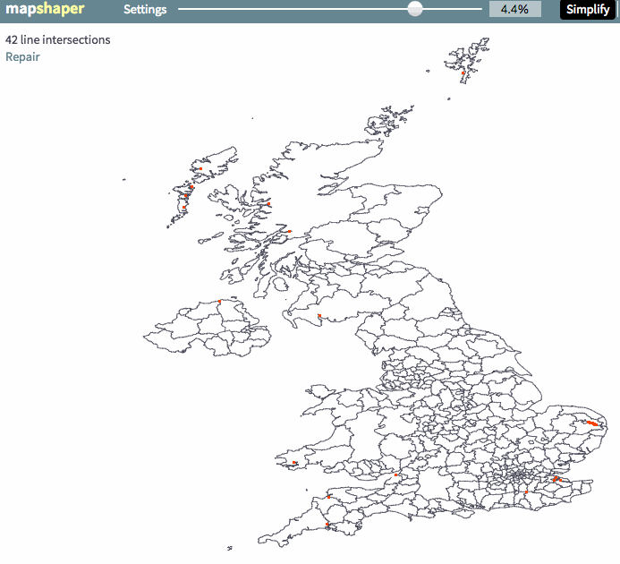

# Designing with spatial data for the web

## Introduction

This workshop is designed to be very hands-on, with many examples that can be
extended as exercises. It would be impossible to touch everything that we could
find [interesting in web mapping](https://hi.stamen.com/an-ode-to-d3-js-projections-9d6477d6da0b#.1hr10rltk),
so the hope is that after going through these three acts you will feel empowered
to swap in your own data and leverage [hundreds of examples](http://blockbuilder.org/search#api=d3.geo.path) in your own data visualization projects!

# Prelude: the landscape

## Servers and clients, rasters and vectors

See: [Anatomy of a web map](http://maptime.io/anatomy-of-a-web-map/) (to be updated)

How things have changed!

# Act I: data is part of design

## Data preparation

## Generalization

* [Mapshaper](http://www.mapshaper.org/) and TopoJSON
  * generalization is not just for file size, it's also important for the _look_ of the map
  * [Use the [Brexit data](http://bl.ocks.org/almccon/7257fe68b3bfa4199e154016d983cddc) as example]

* A tour through the wonderful world of [Natural Earth](http://www.naturalearthdata.com/) datasets
  * Not just what are they, but _why_ are they

* Data precision
  * You don't really need those 8 digits in your decimal degrees: see [geojson-precision](https://www.npmjs.com/package/geojson-precision)
  * See [Decimal degrees on Wikipedia](https://en.wikipedia.org/wiki/Decimal_degrees)

# Act II: numbers to images

## Projections

_Why_ do they matter?

## Classification and choropleths

AKA how to lie with maps:

Equal Interval, Quantiles, Natural Breaks: [example by @mkfreeman](http://bl.ocks.org/mkfreeman/raw/01c5c8464a1f837c6c137e079c9218d0/)
(Note that names from GIS are not the same as in D3)

[Example: [value-by-alpha US election](http://bl.ocks.org/almccon/cb30a0f6bdfa2aa5b15f8022b82bc8b1)]

## Proportional symbols

Example that transitions between bars, boxes, circles, spheres...

## Labels

One of the most difficult things to do programmatically... 

## Legends

* Make your legend a chart!

# Act III: bringing it all together

## Leaflet layer stacking

* [Nat Geo Amazonia examples](https://hi.stamen.com/exploring-the-amazon-with-code-and-data-5750afec6ef2)

## Designing with big(-ish) data

* Playing with opacity

* Heatmaps: love them or hate them

* Hexbins [caliparks examples](https://stamen.cartodb.com/u/stamen-org/viz/9499c9a6-80cd-11e4-9e9b-f23c91504230/public_map)

## Linked views

* [Examples from American Panorama]
  * [Forced Migration](http://dsl.richmond.edu/panorama/forcedmigration)
  * [Foreign Born](http://dsl.richmond.edu/panorama/foreignborn)

## Some thoughts on design
...culminate with some general design principles and talk about the design process w/ ER
